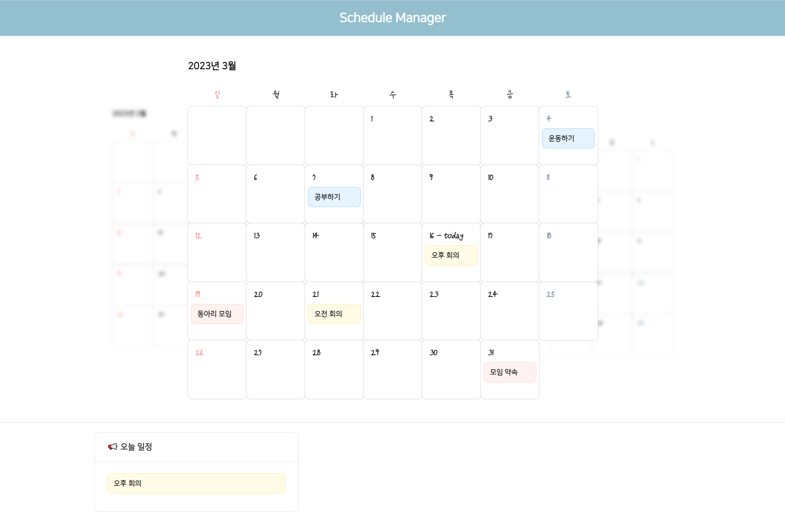

# Mini Project - Scheduler

### 📕 Schedule Manager

스케쥴 매니저는 일정관리를 편리하게 할 수 있는 웹 사이트 입니다.

Front-End-Framework인 React와 css의 @key_frame 기능을 사용하여 부드러운 효과를 낼 수 있도록 구현했습니다.

 

### 💁‍♂️ 프로젝트 기간

개발 기간 : 2023.03.02 ~ 2023.03.16

개발 인원 : 1명

 

### ✨ 사용 기술

Front-End : React, Css

Back-End : [Flask, Docker](https://github.com/hdev1004/Mini-Project-Scheduler/tree/master/flask_server)

 

### 🎨 구현 화면

[구현 영상](https://github.com/hdev1004/Mini-Project-Scheduler/blob/master/media/%EC%8A%A4%EC%BC%80%EC%A5%B4%EB%9F%AC%20%EA%B5%AC%ED%98%84%EC%98%81%EC%83%81.mp4)

